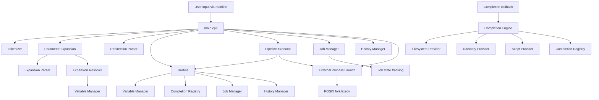

# Shell System Architecture

This project is a compact C++ shell implementation built around a single REPL loop in `src/main.cpp`. The shell accepts user input, tokenizes it, expands variables/history, decides whether the command is a builtin or external program, handles redirection and pipelines, and manages background jobs. The code is organized into a few clear subsystems: parsing, execution, job management, history, completion, and expansion.

---

## 1) High-Level Architecture

---

## 2) Runtime Execution Flow

The shell bootstraps in `src/main.cpp` and enters a continuous REPL loop:

1. Initializes readline completion via `completionCallback`.
2. Loads shell history from `HISTFILE` if present.
3. Reaps any finished background jobs using `JobManager::reapFinishedJobs()`.
4. Reads a line from the terminal using `readline("$ ")`.
5. Expands `!history` syntax if needed via `HistoryManager::expand()`.
6. Tokenizes the input using `tokenize()`.
7. Expands parameter references like `$VAR` via `expandParameters()`.
8. Removes empty tokens created during expansion.
9. Detects pipelines (`|`) and executes them through `executePipeline()`.
10. Otherwise parses redirection operators (`>`, `>>`, `2>`, etc.) using `parseRedirection()`.
11. Checks whether the command is a builtin via `executeBuiltin()`.
12. If not builtin, searches `PATH`, forks a child process, and calls `execv()`.
13. For background jobs, registers them with `JobManager` and prints their job id.
14. On exit, saves history and ends the loop.

This is the core runtime loop that ties all subsystems together.

---

## 3) File-by-File Structure and Responsibilities

### Root-level project files

| File | Role |
| --- | --- |
| `CMakeLists.txt` | Build configuration. Uses CMake with C++23 and links against the Readline library. |
| `codecrafters.yml` | Project configuration used by CodeCrafters challenge runner. |
| `README.md` | Challenge description and usage notes. |
| `your_program.sh` | Script used to start the shell program. |
| `main` | Binary output / generated executable artifact. |

### Shell runtime and orchestration

| File | Role |
| --- | --- |
| `src/main.cpp` | Entry point and main REPL loop. Coordinates parsing, execution, redirection, builtins, jobs, and history. |
| `src/tokenizer.cpp` | Converts raw input into a vector of shell tokens while respecting quoting and escaping. |
| `src/tokenizer.hpp` | Public interface for the tokenizer. |
| `src/command_parser.cpp` | Extracts redirection operators from tokens and returns `RedirectInfo`. |
| `src/command_parser.hpp` | Declares the redirection data model. |
| `src/pipeline.cpp` | Splits commands by `|`, creates pipes, forks child processes, and executes each stage. |
| `src/pipeline.hpp` | Pipeline execution API. |
| `src/builtin.cpp` | Implements shell builtins: `echo`, `exit`, `type`, `pwd`, `cd`, `jobs`, `complete`, `history`, `declare`. |
| `src/builtin.hpp` | Builtin interface and declarations. |

### Job and process lifecycle

| File | Role |
| --- | --- |
| `src/job.hpp` | Defines `Job` and `ReapedJob` structures, including job state information. |
| `src/job_manager.cpp` | Tracks running jobs, marks them done, reaps finished children, and exposes status markers. |
| `src/job_manager.hpp` | Job lifecycle API. |

### History and variable expansion

| File | Role |
| --- | --- |
| `src/history_manager.cpp` | Maintains shell history, supports `!` expansion, and reads/writes history files. |
| `src/history_manager.hpp` | History entry model and manager API. |
| `src/parameter_expansion.cpp` | Replaces shell parameter expansions within tokens. |
| `src/parameter_expansion.hpp` | Public API for parameter expansion. |
| `src/expansion.hpp` | Structure describing an expansion element (`Variable`, `Command`, etc.). |
| `src/expansion_parser.cpp` | Detects `$VAR`, `${VAR}`, and other expansion forms in a token. |
| `src/expansion_parser.hpp` | Expansion parser interface. |
| `src/expansion_resolver.cpp` | Resolves a parsed expansion to its actual runtime value. |
| `src/expansion_resolver.hpp` | Expansion resolver interface. |
| `src/variable.hpp` | Shell variable model. |
| `src/variable_manager.hpp` | Variable registry API; stores shell variables. |

### Completion subsystem

| File | Role |
| --- | --- |
| `src/completion.cpp` | Readline completion callback and command completion engine. |
| `src/completion.hpp` | Completion API. |
| `src/completion_context.cpp` | Builds the completion context from the current command line and cursor position. |
| `src/completion_context.hpp` | Completion context model. |
| `src/completion_registry.cpp` | Stores command-specific completion scripts. |
| `src/completion_registry.hpp` | Completion registry API. |
| `src/completion_spec.hpp` | Definition of a completion spec (`command` + script). |
| `src/filesystem_provider.cpp` | Completes filesystem paths and file names. |
| `src/filesystem_provider.hpp` | Filesystem provider interface. |
| `src/directory_provider.cpp` | Filters directory completions. |
| `src/directory_provider.hpp` | Directory provider interface. |
| `src/script_provider.cpp` | Executes registered completion scripts and returns their completions. |
| `src/script_provider.hpp` | Script completion provider API. |

### Extra/custom files

| File | Role |
| --- | --- |
| `src/comeenting_style` | A repository artifact or helper text file related to coding style/commenting. |

---

## 4) Dependency Map and Interconnections

### Main execution coupling

`src/main.cpp` is the central orchestrator. It depends directly on most major subsystems:

- `tokenizer.hpp` for lexical splitting
- `parameter_expansion.hpp` for variable expansion
- `command_parser.hpp` for redirection handling
- `pipeline.hpp` for pipe-based execution
- `builtin.hpp` for shell builtins
- `job_manager.hpp` for background job tracking
- `history_manager.hpp` for command history and `!` expansion
- `completion.hpp` and `completion_registry.hpp` for readline suggestions

### Parsing pipeline

The command-processing chain looks like this:

`raw input -> tokenize() -> expandParameters() -> parseRedirection() -> builtin or external exec`

This is the baseline shell parsing model. Quoting and escaping are handled by the tokenizer. Variable expansion is then applied to the token list before execution decisions are made.

### Execution pipeline

The shell supports two execution modes:

1. Builtin commands: handled directly in `executeBuiltin()`.
2. External commands: searched in `PATH`, then run with `fork()` and `execv()`.

Pipelines are implemented by splitting a token list around `|` and creating a pipe for each stage. Child processes can execute builtin commands or external commands, and the parent waits for all child processes to finish.

### Job lifecycle

Background jobs are registered in `JobManager::add()`. The manager stores:

- job id
- child PID
- original command string
- current state (`Running` / `Done`)

`main.cpp` periodically calls `JobManager::reapFinishedJobs()` to report completion status to the user.

### History and expansion

The history subsystem stores command strings and supports:

- `!!` for previous command
- `!n` for a specific history entry
- `!-n` for relative history access
- `history` builtin commands to list and save history

This logic is used both in interactive command execution and in command replay.

### Completion system

The shell uses Readline completion callback:

- `completionCallback()` receives the current input buffer
- `buildContext()` builds a `CompletionContext`
- `Completion::getCompletions()` chooses a completion strategy
- `FilesystemProvider`, `DirectoryProvider`, and `ScriptProvider` provide concrete suggestions
- `CompletionRegistry` remembers custom command completion scripts registered through `complete`

This makes completions dynamic and command-aware rather than just filesystem-only.

---

## 5) Architectural Layers

### Layer 1: User Interface Layer

- Readline input
- Completion callback
- REPL loop
- `main.cpp`

This layer handles shell interaction with the user.

### Layer 2: Parsing and Interpretation Layer

- `tokenizer.cpp`
- `command_parser.cpp`
- `parameter_expansion.cpp`
- `expansion_parser.cpp`
- `expansion_resolver.cpp`

This layer converts raw text into a structured command model.

### Layer 3: Execution Layer

- `builtin.cpp`
- `pipeline.cpp`
- system process spawn using `fork()` and `execv()`

This layer decides how a parsed command is executed.

### Layer 4: Process and Session State Layer

- `job_manager.cpp`
- `history_manager.cpp`
- `variable_manager.hpp`

This layer manages shell state across commands and sessions.

### Layer 5: Completion Layer

- `completion.cpp`
- filesystem/directory/script providers
- registry

This layer enhances user experience and integrates with Readline.

---

## 6) Design Summary

This project follows a classic shell architecture:

- REPL-driven interactive loop
- pipe-aware process execution
- builtin and external command split
- redirection-aware execution
- process/job lifecycle tracking
- history expansion and persistence
- shell variable expansion support
- Readline-based auto-completion integration

It is intentionally compact but architecturally clean. The design keeps the runtime orchestration in `main.cpp`, while specialized logic is isolated into focused modules so each subsystem has a single responsibility.

---

## 7) Overall Interaction Model

In one sentence: the shell reads text, transforms it into tokens and structured command semantics, executes it as either a builtin or a subprocess, tracks state such as jobs/history/variables, and feeds interactive context back into the user through completion and status reporting.
